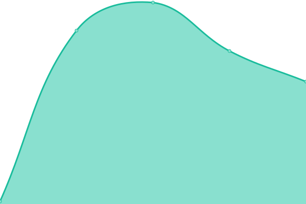

<!--start: status pages-->
<!-- This summary is generated by Upptime (https://github.com/upptime/upptime) -->
<!-- Do not edit this manually, your changes will be overwritten -->
<!-- prettier-ignore -->
| URL | Status | History | Response Time | Uptime |
| --- | ------ | ------- | ------------- | ------ |
|  [Google](https://www.google.com) | 🟩 Up | [google.yml](https://github.com/animatedcreativity/up/commits/HEAD/history/google.yml) | 

 69ms
     
 | 

<a href="https://up.ylo.one/history/google">100.00%</a>
    

|  [Wikipedia](https://en.wikipedia.org) | 🟩 Up | [wikipedia.yml](https://github.com/animatedcreativity/up/commits/HEAD/history/wikipedia.yml) | 

 228ms
     
 | 

<a href="https://up.ylo.one/history/wikipedia">100.00%</a>
    

|  [Test Broken Site](https://thissitedoesnotexist.koj.co) | 🟥 Down | [test-broken-site.yml](https://github.com/animatedcreativity/up/commits/HEAD/history/test-broken-site.yml) | 

 0ms
     
 | 

<a href="https://up.ylo.one/history/test-broken-site">100.00%</a>
    

|  [Animated Creativity](https://animatedcreativity.com/) | 🟥 Down | [animated-creativity.yml](https://github.com/animatedcreativity/up/commits/HEAD/history/animated-creativity.yml) | 

 205ms
     
 | 

<a href="https://up.ylo.one/history/animated-creativity">99.87%</a>
    

<!--end: status pages-->

[**Visit our status website →**](https://up.ylo.one)
