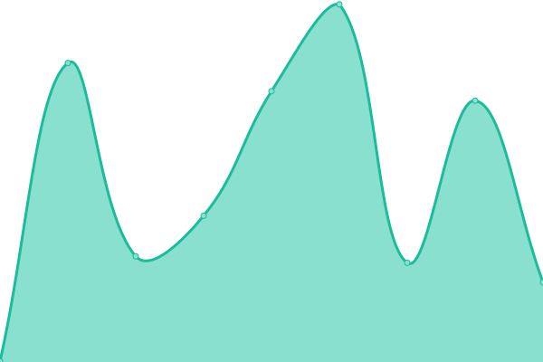
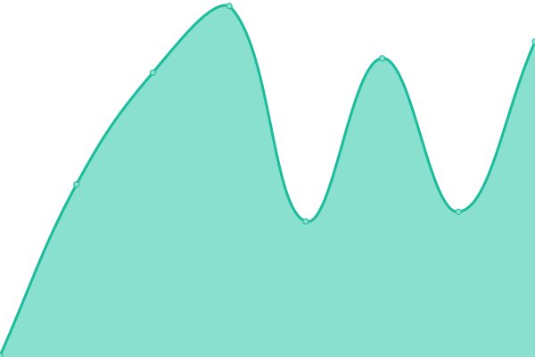

<!--start: status pages-->
<!-- This summary is generated by Upptime (https://github.com/upptime/upptime) -->
<!-- Do not edit this manually, your changes will be overwritten -->
<!-- prettier-ignore -->
| URL | Status | History | Response Time | Uptime |
| --- | ------ | ------- | ------------- | ------ |
|  [Animated Creativity](https://animatedcreativity.com/) | 🟩 Up | [animated-creativity.yml](https://github.com/animatedcreativity/up/commits/HEAD/history/animated-creativity.yml) | 

 187ms
     
 | 

<a href="https://up.ylo.one/history/animated-creativity">100.00%</a>
    

|  [ThemeSpiration](https://themespiration.com/) | 🟩 Up | [theme-spiration.yml](https://github.com/animatedcreativity/up/commits/HEAD/history/theme-spiration.yml) | 

 214ms
     
 | 

<a href="https://up.ylo.one/history/theme-spiration">100.00%</a>
    

|  [CodePen Profile](https://codepen.io/animatedcreativity/) | 🟥 Down | [code-pen-profile.yml](https://github.com/animatedcreativity/up/commits/HEAD/history/code-pen-profile.yml) | 

 84ms
     
 | 

<a href="https://up.ylo.one/history/code-pen-profile">0.00%</a>
    

<!--end: status pages-->

[**Visit our status website →**](https://up.ylo.one)
